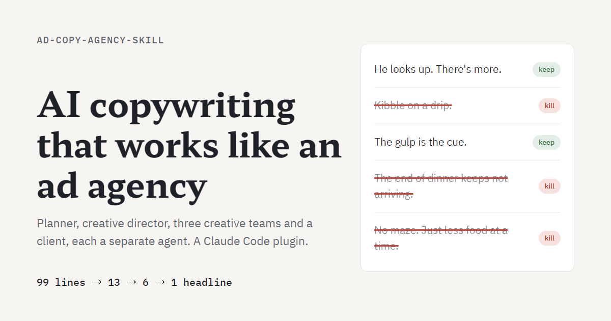

# ad-copy-agency-skill: AI copywriting that works like an ad agency

**Language**: English | [한국어](README.ko.md) · **Site**: https://5hyuns.github.io/ad-copy-agency-skill/ · **Demo**: https://5hyuns.github.io/ad-copy-agency-skill/demo/

An open-source [Claude Code](https://claude.com/claude-code) skill for AI ad copywriting. It writes advertising headlines by running a real ad agency workflow with one AI agent per role: planner, creative director, three creative teams and the client. The skill is named `copy-masters`.

Ads are rarely one person writing one good sentence. A planner reframes the brief, a creative director reviews it, several teams write a lot of lines, the CD cuts them down more than once, and the client picks. The skill follows that order. Each role is a separate agent that sees only the files the previous step left behind, teams never pick their own lines, and the CD judges lines with team names hidden. At the end you get a final headline, two alternates, the path each line took, and a table checking that every step ran as the agency workflow expects.

> **There is no evidence that it beats a single well-written prompt.** Read [Limits](#limits) first. It writes Korean copy for the Korean market and English copy for the US market.



## Quick start

Install it as a plugin, inside a Claude Code session:

```
/plugin marketplace add 5hyuns/ad-copy-agency-skill
/plugin install copy-masters@ad-copy-agency-skill
```

Start a new session (or run `/reload-plugins`) and the skill is `/copy-masters:copy-masters`. Update with `/plugin marketplace update ad-copy-agency-skill`.

If you would rather have the files in a skills folder, clone it instead. Keep the folder name `copy-masters`; then the skill is `/copy-masters` and you update with `git pull`.

```bash
# all projects (macOS, Linux, Git Bash)
git clone https://github.com/5hyuns/ad-copy-agency-skill.git ~/.claude/skills/copy-masters

# all projects (Windows PowerShell)
git clone https://github.com/5hyuns/ad-copy-agency-skill.git "$HOME\.claude\skills\copy-masters"

# one project only
git clone https://github.com/5hyuns/ad-copy-agency-skill.git .claude/skills/copy-masters
```

Call it like this (plugin install: `/copy-masters:copy-masters`). Add `카피 언어 (copy language): en` for English copy; the market then defaults to `us`. Field names are Korean; values can be in any language.

```
/copy-masters
주제 (subject): a smart pillow that tilts your head when it hears snoring
사업 목표 (business goal): more 30-day trial orders from Instagram ads
타깃 (target): people in their 30s-50s who sleep apart because a partner snores
모드 (mode): 퍼포먼스 (performance)
채널 (channel): SNS 피드 (social feed)
브랜드명 (brand): Nuumlab
필수 사항 (must-haves): not a medical device
사용자 자료 (your material): ./material.md
카피 언어 (copy language): en
```

You can also just ask for ad copy or headlines in plain words. If a required input is missing, it asks before starting.

Requirements: Claude Code and Python 3 (the helper scripts use only the standard library). Raw material collection uses a web search tool when available and falls back to the material you provide.

## Inputs

| Input | Required | Value |
|---|---|---|
| 주제 subject | yes | What is being advertised |
| 사업 목표 business goal | yes | One short line, such as "more trial orders" |
| 타깃 target | yes | Who the ad speaks to |
| 모드 mode | yes | `퍼포먼스` performance (clicks, conversions) or `브랜드` brand (memory, attitude) |
| 채널 channel | yes | `SNS 피드` social feed, `검색광고` search ads, `상세·랜딩페이지` product or landing page, `영상 스크립트` video script |
| 브랜드명 brand | yes | Names the output folder and the learning log |
| 제품 진실 product truth | no | What the company itself says is the core of the product |
| 필수 사항 must-haves | no | What must or must not appear, tone rules |
| 업종 industry | no | Adds industry-specific regulation checks |
| 사용자 자료 your material | no | Decks, reviews, interviews. Approved customer quotes reach the shortlist verbatim |
| 카피 언어 copy language | no | `ko` (default) or `en` |
| 시장 market | no | `kr` or `us`: which country's channel specs and ad law the client checks against. Defaults to `kr` for Korean copy and `us` for English |

It never guesses the mode, channel or target. Product numbers, conditions, reviews and certifications come only from the raw material or your files; anything unverified is flagged `[의뢰인 확인 필요]` (client to confirm).

## Workflow

| Step | Role | What happens | Output |
|---|---|---|---|
| 1 | Client brief | Inputs written down as given | `01-client-brief.md` |
| 2 | Raw material | Product facts, what people wrote, competitor copy, verbatim with sources | `02-raw.md` |
| 3 | Planner | Reframes the task as "what this ad must say" and writes the creative brief | `03-creative-brief.md` |
| 4 | Creative surgery | CD reviews the brief; the planner may revise once | `04-surgery.md` |
| 5 | Three teams | Run in sequence, 3 to 5 routes and 33 lines each; later teams avoid routes already taken | `05-team-*.md` |
| 6 | CD round 1 | Criteria first, then keep or kill on every line; 3 to 5 routes survive | `06-cd-review-1.md` |
| 7 | Rework and defense | Teams rewrite surviving routes and may defend one killed line | `07-team-*.md` |
| 8 | CD round 2 | Rules on defenses, shortlists about five lines | `08-cd-review-2.md` |
| 9 | Client | Fact and advertising-law check, then one final line and two alternates | `09-client-review.md` |
| 10 | Handoff | The path each line took and a process check table | `10-final.md`, `10-process-check.md` |

Outputs go to `copy-runs/<brand>/<date>-<topic>/` in your working directory. Running the same brand again surfaces lessons from `copy-runs/<brand>/learning-log.md` first.

## Demo

One full run on a fictional smart pillow. The planner moved the audience from the snorer to the partner lying awake next to them, the CD sent the first brief back once, three teams wrote 99 lines, and the client picked an approved customer quote, "남편이 처음으로 제가 먼저 잠들었대요" ("My husband says that for the first time, I fell asleep first"). Every line with the CD's verdict and reason is on the [demo page](https://5hyuns.github.io/ad-copy-agency-skill/demo/).

The run used 13 sub-agents, about 20 minutes and about 1.04M sub-agent tokens.

## Limits

- Compared head to head with a single prompt given the same raw material, the skill's final lines won 0.37 of the time on average. Treat its output as about as good as, or worse than, one well-written prompt.
- The reason to use it is the process. You can follow each step, and the brief check and client review catch factual errors a single prompt repeated across runs, such as unsupported claims or edited customer quotes.
- The CD and the client are the same model. Re-running the same pool can change the final line.
- **English copy has been tested once.** On one fictional US product the English run worked end to end (all 46 process checks, every verdict parsed), but its three picks won 0.39 of blind comparisons against two single-prompt runs. The client's longest pick lost every pair while one of its alternates was the second strongest line. That number leans on one client pick: given the same shortlist nine more times, the client chose the 43-character alternate every time, and that line scored 0.67 against the single-prompt lines. Lines get longer at team rework (41.8 characters for round-1 survivors, 58.5 for rewrites), not at the CD's shortlist. The US regulation checklist did its job: the client dropped a customer quote under the FTC's typical-results rule (16 CFR 255.2).
- It writes headlines only. Visuals, subheads and body copy are out of scope.
- See "알려진 한계" (known limits) in [SKILL.md](SKILL.md) for the full list. Paths under `reports/`, `research_notes/` and `skill-tests/` cited there are design evidence kept outside this repository and are not needed to run the skill.

## Repository layout

- `SKILL.md`: steps, principles and known limits
- `templates/common/`: collection, planner and creative surgery prompts, shared by both languages
- `templates/ko/`, `templates/en/`: team, CD and client prompts, written separately for each language rather than translated
- `scripts/`: `build_pool.py` moves and hides lines between roles, `assemble.py` builds the final report and process check
- `references/kr/`, `references/us/`: channel specs and the fact and regulation checklist for each market (US: FTC Act Section 5, deception and substantiation statements, 16 CFR 255 and 465, FDA general wellness)
- `docs/`: the project site and demo page (GitHub Pages)

## License

MIT. See [LICENSE](LICENSE).

## Background

The name copy-masters comes from versions 1 to 4, which imitated the methods of famous copywriters (David Ogilvy, Bill Bernbach, Taniyama Masakazu, Jung Chul). Version 5 dropped that design and follows the agency workflow instead. The design draws on production records of 25 well-known campaigns and on Turnbull & Wheeler's research on London advertising agencies, where only two of 24 steps produced ideas and the rest were about agreeing on the problem and checking the work.

Related keywords: AI copywriting, ad copy generator, headline generator, Claude skills, Claude Code skill, multi-agent workflow, creative brief, advertising agency, 광고 카피, 카피라이팅, 헤드라인.
